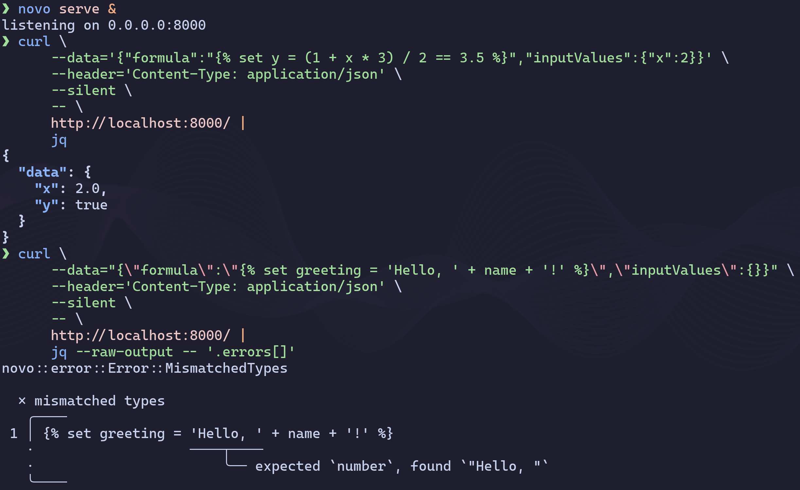

# Novo

The **novo** language is a fast, portable, and secure domain-specific
programming language. It aims to be a subset of the
[Twig](https://twig.symfony.com/) templating engine with additional features,
but without HTML support. The main use case is for mathematical calculations.
Like Twig, it will allow a context to be passed as input, and the output of code
execution will be a modified context, not HTML.

## Syntax

The subset of Twig includes:

- Literals:
  - `null`
  - booleans: `false` and `true`
  - numbers, e.g. `0`, `123`, `45e-6`, `7.89`
  - strings, e.g. `''`, `'first line\nsecond\tline'`
- Built in functions, e.g. `default`, `round_down`, `round_up`, `spaceless`.
- Statemets: `if` and `set`
- Unary operations: `-` (negation) and `+`
- Binary operations:
  - `+` (addition)
  - `and`
  - `~` (concatenation)
  - `/` (division)
  - `==` (equality)
  - `|` (filtering, a.k.a flipped function application)
  - `>=`
  - `>`
  - `in` (containment test)
  - `<=`
  - `<`
  - `*` (multiplication)
  - `!=` (inequality)
  - `or`
  - `-` (subtruction)

## Features

### Simpler syntax

This: 

Can also be written as this: 

### Nicer error messages

### Error recovery

The lexer, parser and type checker will not stop at the first error.

### No distinction between functions and filters

All these options are equivalent:

### REPL

### Command line interface

### Web server

